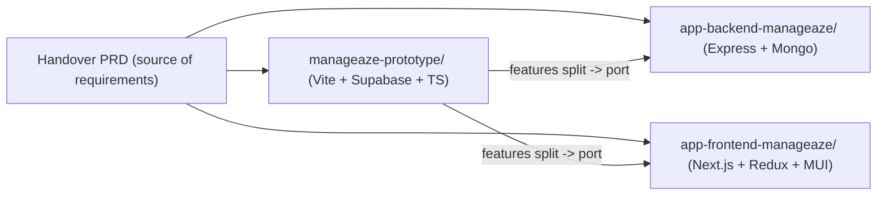
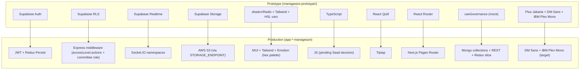

# ManagEaze Multi-Repo Governance + Phased Port Plan

## 0. Workspace Context

Three repos live under `/Users/adeemadilkhatri/Projects/ManagEaze/`:

- `[app-backend-manageaze/](app-backend-manageaze/)` — **Production backend** (Node 20 + Express 4 + Mongoose 8 + Socket.IO 4 + JWT). Read-only for now.
- `[app-frontend-manageaze/](app-frontend-manageaze/)` — **Production frontend** (Next.js 14 Pages Router + Redux Toolkit + redux-persist + MUI 6 + Tailwind + Emotion + TipTap). Read-only for now.
- `[manageaze-prototype/](manageaze-prototype/)` — **Prototype** (Vite + React 18 + TypeScript + Supabase + shadcn/Radix + Tailwind + React Quill). Canonical UI/feature reference per PRD.




---

## 1. Findings Summary (what each repo has / lacks)

### 1.1 `[manageaze-prototype/](manageaze-prototype/)` (prototype) — source of truth

**Has (governance M2 core):**

- Types: `[src/types/governance.ts](manageaze-prototype/src/types/governance.ts)` (complete PRD-aligned shape).
- State: `[src/hooks/useGovernance.ts](manageaze-prototype/src/hooks/useGovernance.ts)` (in-memory context; uses `[src/data/governance-mock.ts](manageaze-prototype/src/data/governance-mock.ts)`).
- UI: `[src/pages/governance/GovernanceDashboard.tsx](manageaze-prototype/src/pages/governance/GovernanceDashboard.tsx)`, `[FrameworkWizard.tsx](manageaze-prototype/src/pages/governance/FrameworkWizard.tsx)`, `[TorList.tsx](manageaze-prototype/src/pages/governance/TorList.tsx)`, `[TorEditor.tsx](manageaze-prototype/src/pages/governance/TorEditor.tsx)`, `[TorPreview.tsx](manageaze-prototype/src/pages/governance/TorPreview.tsx)`, `[TorReview.tsx](manageaze-prototype/src/pages/governance/TorReview.tsx)`, `[MeetingMinutes.tsx](manageaze-prototype/src/pages/governance/MeetingMinutes.tsx)`, `[VotingDecisions.tsx](manageaze-prototype/src/pages/governance/VotingDecisions.tsx)`, `[TaskAutomation.tsx](manageaze-prototype/src/pages/governance/TaskAutomation.tsx)`.
- Components: `[CommitteeTree.tsx](manageaze-prototype/src/components/governance/CommitteeTree.tsx)`, `[GovernanceGraphView.tsx](manageaze-prototype/src/components/governance/GovernanceGraphView.tsx)`, `[TorForm.tsx](manageaze-prototype/src/components/governance/TorForm.tsx)`, `[TorApprovalPanel.tsx](manageaze-prototype/src/components/governance/TorApprovalPanel.tsx)`, `[TorVersionHistory.tsx](manageaze-prototype/src/components/governance/TorVersionHistory.tsx)`.
- Activity logging: `[src/lib/activity-logger.ts](manageaze-prototype/src/lib/activity-logger.ts)` (calls Supabase RPC `log_activity`).

**Known defects / drift from PRD:**

- Editor is **React Quill**, not Tiptap (PRD recommends Tiptap; production already has it).
- `[src/pages/governance/OrgChart.tsx](manageaze-prototype/src/pages/governance/OrgChart.tsx)` re-exports **team** org chart instead of a committee graph.
- `[TaskAutomation.tsx](manageaze-prototype/src/pages/governance/TaskAutomation.tsx)` and `[MeetingIntegrationCard.tsx](manageaze-prototype/src/components/governance/MeetingIntegrationCard.tsx)` are static placeholders.
- `[VotingDecisions.tsx](manageaze-prototype/src/pages/governance/VotingDecisions.tsx)` hardcodes `currentUserId = "m-2"`.
- README claims BlockNote; actual code uses React Quill.
- Extras NOT in PRD (must decide scope): Polybot AI agent, Knowledge Base + embeddings, Quizzes, Risk module, Compliance auditor, Marketing/Present pages, `/api/chat` Express proxy in `[server.js](manageaze-prototype/server.js)`.

### 1.2 `[app-backend-manageaze/](app-backend-manageaze/)` (production backend)

**Has:** user/company/policy/comment/approval/team/department/designation/access-level/subscription/plan-type/ragbot + partial governance at `[routes/governance.js](app-backend-manageaze/routes/governance.js)` backed by `[models/governance.js](app-backend-manageaze/models/governance.js)` + `[models/comitteeLevel.js](app-backend-manageaze/models/comitteeLevel.js)`. JWT at `[middlewares/validate-token.js](app-backend-manageaze/middlewares/validate-token.js)`; access-level/action checks at `[middlewares/validate-access-level.js](app-backend-manageaze/middlewares/validate-access-level.js)` and `[middlewares/validate-action.js](app-backend-manageaze/middlewares/validate-action.js)`. Socket.IO namespaces: `/comments`, `/file-extraction`, `/rag-chatbot`. OpenAI + Pinecone + SendGrid + Stripe + AWS S3 (SDK v2).

**Missing vs PRD:**

- M1: `GET /user/assignments`, `POST /user/refresh`, `POST /notifications/register`, FCM integration, OpenAPI spec.
- M2: `governance_frameworks`, proper `committees` (PRD shape), `terms_of_reference`, `meetings`, `voting_decisions` collections; TOR/meeting/voting routes; LLM + Transcription provider abstractions.
- M3: BullMQ + Redis, scheduled jobs (node-schedule dep is unused), compliance dashboard aggregations, electronic voting rules.

**Latent bugs to fix in prod-port PR (not now):**

- Role string mismatch: `validate-manageaze-admin.js` checks `'manageaze-admin'` vs `ROLES.Manageaze_ADMIN === 'manageaze_admin'` in `utils/constants.js`.
- `[utils/pinecone-config.js](app-backend-manageaze/utils/pinecone-config.js)` `queryVector` references `req.body.companyId` out of scope.
- `[routes/ragbot.js](app-backend-manageaze/routes/ragbot.js)` uses `NotFoundError` without import.
- `express.json()` mounted twice (root `index.js` + `startup/routes.js`).
- Model naming typo: `comitteeLevel` / fields `comitteeName`, `comitteeOwner`, `comitteeType`; `parent` ref points to `'Level'` (no such model).
- Governance JWT stores `accessLevel` as **name string**, not ObjectId — PRD permission layer assumes the full access-level object; reconcile before M2.

### 1.3 `[app-frontend-manageaze/](app-frontend-manageaze/)` (production frontend)

**Has:** Full policy lifecycle (drafts, review, library, detail, edit, shared, generate), MUI+Tailwind shell, TipTap at `[src/components/base/TipTapEditor/index.js](app-frontend-manageaze/src/components/base/TipTapEditor/index.js)` used by `[src/pages/policy/edit/[id].js](app-frontend-manageaze/src/pages/policy/edit/[id].js)`, Redux store at `[src/redux/store.js](app-frontend-manageaze/src/redux/store.js)`, axios client at `[src/api/index.js](app-frontend-manageaze/src/api/index.js)`, socket providers at `[src/context/socket/*](app-frontend-manageaze/src/context/socket)`.

**Gaps / defects:**

- `/governance/`* pages exist but sidebar is `disabled={true}` in `[src/components/base/layout/sidebar/index.js](app-frontend-manageaze/src/components/base/layout/sidebar/index.js)`.
- No TOR editor/review, no full committee tree, no meetings UI, no voting UI, no compliance dashboard.
- `[src/services/rag-chat.js](app-frontend-manageaze/src/services/rag-chat.js)` reads JWT from `localStorage.auth_token` — diverges from Redux token flow.
- `styled-components` is a dep but not imported anywhere.
- `companyColorTheme` only partially applied (not into MUI `palette.primary`).
- Editor.js packaged but unused.

### 1.4 Environment files — security findings (CRITICAL)

User initially shared two env files in swapped locations; they have since been moved back to the correct repos. Current verified placement (full redacted analysis goes into `docs/SECRETS.md` as a Phase 0 deliverable):

- `[app-backend-manageaze/env](app-backend-manageaze/env)` — backend keys (`PORT`, `MONGO_URI`, `JWT_SECRET`, `SENDGRID_API_KEY`, `AWS_`*, `OPENAI_API_KEY`, `STRIPE_SECRET_KEY`, `PINECONE_API_KEY`, Anchor `ACME_*`). **Correct repo, but filename should be renamed to `.env.development` and added to `.gitignore`.**
- `[app-frontend-manageaze/.env.development](app-frontend-manageaze/.env.development)` — frontend keys (`NEXT_PUBLIC_API_BASE_URL`, `NEXT_PUBLIC_AI_MODULE_BASE_URL`, `NEXT_PUBLIC_S3_`*, `NEXT_PUBLIC_AWS_`*, `NEXT_PUBLIC_OPENAI_API_KEY`, `NEXT_PUBLIC_API_SOCKET_BASE_URL`, `NEXT_PUBLIC_MODE`). Filename is correct; needs `.gitignore` verification.

Confirmed open questions answers (from this session): env-file placement is now correct (user re-swapped). Secret rotation is owned by **Saad V.** — Phase 2 is gated on his confirmation.

**Critical security issues that block any prod-port work until rotated:**


| Severity | Issue                                                                                             | Where        | Fix                                                                                          |
| -------- | ------------------------------------------------------------------------------------------------- | ------------ | -------------------------------------------------------------------------------------------- |
| P0       | AWS access key + secret in `NEXT_PUBLIC_`* (browser-exposed)                                      | frontend env | Rotate AWS keys; move S3 access server-side via signed URLs from backend                     |
| P0       | OpenAI key in `NEXT_PUBLIC_OPENAI_API_KEY` (browser-exposed)                                      | frontend env | Rotate OpenAI key; route AI calls through backend or the policy-maker service                |
| P0       | Same AWS key pair reused on backend AND frontend                                                  | both         | Issue separate IAM users (e.g. `manageaze-backend-s3-rw`, `manageaze-frontend-presign-only`) |
| P0       | `STRIPE_SECRET_KEY=sk_live_`* in a dev env file                                                   | backend env  | Rotate live key; replace dev value with `sk_test_*`                                          |
| P0       | `JWT_SECRET=manageaze-secret` (weak, guessable)                                                   | backend env  | Replace with 256-bit random; rotation invalidates existing tokens — coordinate with Saad     |
| P1       | SendGrid + Pinecone keys committed                                                                | backend env  | Rotate; move to secret manager when self-host story lands                                    |
| P1       | MongoDB Atlas creds in `MONGO_URI` (plaintext)                                                    | backend env  | Acceptable in env file; confirm `.gitignore` and git-history are clean                       |
| P2       | Anchor.dev / `lcl.host` local-CA config (`ACME_*`, `SERVER_NAMES=app-backend-manageaze.lcl.host`) | backend env  | Document; useful for local HTTPS dev, no rotation needed                                     |


**Other findings from env inspection:**

- **Fourth deployable confirmed: the `policy-maker` AI module on :8000.** Surfaced via `NEXT_PUBLIC_AI_MODULE_BASE_URL=http://localhost:8000/policy-maker/api/v1/` and consumed by `[src/services/ai-policy.js](app-frontend-manageaze/src/services/ai-policy.js)`. Endpoints: `POST /policies/chat`, `GET /policies/conversation/{id}`, `PATCH /policies/conversation/update/{id}`, plus a streaming flow proxied through the Next.js API route `/api/policies/chat-stream`. Per user clarification this service belongs to the **old production stack** (`app-backend-manageaze` + `app-frontend-manageaze`), NOT to `manageaze-prototype/`. The repo lives outside this workspace; Saad to share the location. Inventory captured in `[docs/INVENTORY-policy-maker.md](docs/INVENTORY-policy-maker.md)` once located. Implications:
  - It is the **first existing example of a non-Node service** in the stack — the M3 LLM provider abstraction (RFC-030) needs to subsume or coexist with it.
  - `generatePolicyWithAIStream` already streams via SSE — the M3 meeting-intel pipeline can reuse the same SSE pattern.
  - Self-host plan must include this service in `docker-compose.yml` (Phase 5).
- `API_BASEURL=/manageaze/api` confirms the PRD `/manageaze/api/` base path, matching rule §2.1 #8.
- `CLIENT_URL=http://localhost:3000` confirms Next.js dev port; CORS rule (PRD §CORS) needs explicit RN-mobile origin too.
- `NEXT_PUBLIC_API_SOCKET_BASE_URL=http://localhost:5000` confirms socket layer is on the same port as the REST API, not a separate socket server.

### 1.5 Saad Hasnain demo + Q&A — 2026-04-27 meeting (with Aijaz, Wajahat, Adeem)

Recording: `https://fathom.video/share/4AxM3zWsbWU8ss-kT6GBQCu9r2UfWa5B`. Headline: **Saad H. confirms the prototype IS the product vision**, explicitly says he is "not satisfied" with the production stack, "feels more comfortable showing the prototype to investors/clients than the production-ready platform itself." This locks in our rule §2.1 #3 ("Prototype is canonical") with founder authority.

**Confirmed product flow (binds Phase 3 M2 RFCs):**

- **Roles + permission taxonomy** (came from Deloitte engagement; flex-per-company at onboarding):
  - **Viewer** = ordinary company member, opens policy library only — **FREE seat**.
  - **Creator** = L4 individual contributor; can only create policies, cannot review/approve.
  - **Reviewer** = L3 / dept head / VP; reviews + comments, can set approval conditions, can be multiple per policy.
  - **Approver** = L1/L2 / C-level (CEO/CFO/CIO); final approval gate.
  - L1/L2/L3/L4 levels are platform-wide (`user.accessLevel`); Creator/Reviewer/Approver/Viewer is the contextual role within a committee/policy. Reconciles to PRD's two-axis permission model — exactly what RFC-021 needs.
- **Governance framework** (the M2 deliverable):
  - Yearly cadence; multiple frameworks per company allowed.
  - Tree: Board of Directors → committees → subcommittees. Each committee has owner, type, members, meeting frequency, and exactly **one TOR document**.
  - Saved framework = company-wide org chart. Super-user editability is a Saad-V. open question.
- **TOR template fields** (binds RFC-020 schema): committee name, committee owner, member-count required, meeting frequency, purpose, roles & responsibilities, agenda.
- **TOR approval workflow = policy approval workflow** (creator = committee owner → reviewer(s) → approver). RFC-020 reuses the policy-approval state machine.
- **Meetings + voting:**
  - Notes on platform; integrations with **Microsoft Teams**, **Microsoft Word**, **Google Workspace** are required (clients want to switch from Teams).
  - Decision register per meeting: title, status, vote.
  - **Vote types: yes / no / abstain**, recorded after the meeting; anyone with role can vote.
  - **Saad explicitly REJECTED AI auto-voting** ("AI isn't that correct"). RFC-034 must be manual-only; AI may *summarize* discussion but not cast votes.
- **Tasks come from policies** (e.g., incident-response policy generates checklist tasks); assigned to users; completion matrix surfaces on the compliance dashboard. Binds RFC-035.
- **Auditor view** = read-only audit trail per policy (drafts → approved → amendments). Already partially in prototype's `activity-logger.ts`; ship in M2 with the TOR/policy port.

**Pricing model (NEW — not in PRD):**

- $20 / user / month, $200 / user / year (annual).
- **Per-seat charged for Creator + Reviewer + Approver only.** Viewer is free.
- Custom quote per company expected ("we don't want to understand company's requirements" → bespoke).
- AI agent: Saad considered usage credits but rules viewer-free-AI in. Open question whether AI is metered separately.
- **No RFC currently scoped for billing/seats** — adds a new Phase-4-or-later RFC slot.

**Out of scope (confirmed by Saad):**

- **Risk module** — "still being defined", Saad cannot explain it well. Drop from M2/M3, revisit post-M3.
- **Compliance Auditor** — partial scope: only the audit-trail-view + RAG-over-policies. The deeper "compliance check" (verify policy adhered-to-in-code) is acknowledged as out of scope.

**ICP refined:**

- Healthcare, finance, tech, regulated industries (Saudi GDPR, banking).
- Sweet-spot company size **500–2000 employees**, can extend down to 100–500 with C-level buy-in.
- **Banks (esp. UAE/Saudi) require self-hosting + data residency.** Confirms PRD §Self-host as a sales-blocker — Phase 5 docker-compose is non-negotiable.
- Faisal Bhai positions the product as a **GRC platform** (Governance / Risk / Compliance), not just policy. RFC-035 compliance dashboard is the keystone.

**Sales context (informs Aijaz/Wajahat track, not engineering):**

- 3 prior client deals stalled; UAE bank vanished citing self-host/data-residency lag. Engineering implication: ship the self-host story before the next pitch cycle.
- Common objection: "we already use Google Docs / Notion / Microsoft Workspace." Counter is the GRC bundle (TOR + meetings + voting + tasks + RAG + audit trail), not the editor.

**Process:**

- Aijaz to broker a follow-up call with Faisal Bhai (Saad V.); Adeem to lead Zaps technical side. Wajahat to do a code walkthrough first.
- That call is the right venue to clear the §3 open questions.

---

## 2. Multi-Repo Working Agreement (STRICT)

### 2.1 Global rules (all sessions, all agents)

1. **No edits to `app-backend-manageaze/` or `app-frontend-manageaze/` until the user explicitly opens a "prod-port" phase for that feature.** These are read-only references right now.
2. **PRD is the contract.** Any deviation requires an ADR in `[docs/decisions/](docs/decisions)` (root-level) with Saad H./V. sign-off.
3. **Prototype is canonical for UI/UX and feature logic.** "Do not redesign, do not reinvent" (PRD §Overview).
4. **Self-hostable.** No AWS Lambda/SQS/Azure-specific code. All AI/LLM and storage calls go through provider interfaces.
5. **Field naming is camelCase** in any new production code. New collections use `companyId` (PRD §M2 Part A).
6. **JWT only.** No cookies, no sessions. Token is `Authorization: Bearer <token>`.
7. **Never log or return password hashes.** Fix the PRD-flagged `/user/login` leak BEFORE any mobile work.
8. **Every new backend route** sits under `/manageaze/api/`.
9. **Every new Mongo collection** has: `_id`, `companyId`, `createdAt`, `updatedAt`, explicit ON DELETE FK behavior (ref + `deleted_at` if soft delete), indexes on FKs + filtered queries.
10. **No implementation without an RFC** in `[docs/rfcs/](docs/rfcs)` (root-level) for anything that touches the production stack (schema, auth, socket events, provider interfaces).
11. **Root docs are authoritative.** All cross-repo governance, RFCs, ADRs, design tokens, and open questions live in the **root** `docs/` — not inside `manageaze-prototype/docs/`. The prototype's existing internal `manageaze-prototype/docs/` is legacy and not updated.
12. **Secrets discipline.** No env file, key, token, or credential is ever committed. Each repo ships a `.env.example` with placeholder values only. Server secrets (AWS, OpenAI, Stripe, SendGrid, Pinecone, JWT, Mongo) NEVER use the `NEXT_PUBLIC_`* prefix or any frontend-bundled var. Frontend gets short-lived signed URLs / proxy endpoints from the backend instead.
13. **Secret rotation gate.** Before the first prod-port PR (Phase 2 onward) lands, the §1.4 P0 keys MUST be rotated and the rotation logged in `[docs/SECRETS.md](docs/SECRETS.md)`. `code-reviewer` blocks any PR that touches an env-loaded code path until this gate is signed off.

### 2.2 Per-repo boundaries


| Repo                                                 | Allowed actions NOW                                                                                                                                 | Allowed actions in PORT phase                                                 | Blocked forever                                       |
| ---------------------------------------------------- | --------------------------------------------------------------------------------------------------------------------------------------------------- | ----------------------------------------------------------------------------- | ----------------------------------------------------- |
| Root (`ManagEaze/`)                                  | Scaffold `docs/`, `AGENTS.md`, `CLAUDE.md`, `GEMINI.md`                                                                                             | Keep docs/RFCs updated                                                        | —                                                     |
| `[manageaze-prototype/](manageaze-prototype/)`       | Read, organize, prune dead code, fix bugs, align types to PRD, freeze as reference (NO new docs in `manageaze-prototype/docs/` — root `docs/` only) | Keep in sync when PRD schema evolves                                          | —                                                     |
| `[app-backend-manageaze/](app-backend-manageaze/)`   | Read only                                                                                                                                           | Add new routes/models/middleware per RFC; never break existing web clients    | Delete/rename existing models, change auth flow shape |
| `[app-frontend-manageaze/](app-frontend-manageaze/)` | Read only                                                                                                                                           | Add new pages/components/slices per RFC; keep Redux Persist key `root` intact | Swap MUI for a different lib, change router type      |


### 2.3 Per-agent operating contracts

Each agent invocation MUST start by reading the relevant files below. Include these in every Task prompt.

`**[/code-architect](…)` — used for: RFCs, cross-cutting design, phase planning**

- Scope: produce design docs to `[docs/rfcs/NNNN-<slug>.md](docs/rfcs)`. Never write feature code.
- Inputs it must read: the PRD, `[docs/DESIGN-target.md](docs/DESIGN-target.md)`, `[src/types/governance.ts](manageaze-prototype/src/types/governance.ts)`, relevant prototype feature files, corresponding production file (if porting).
- Output: RFC with sections: Motivation, Schema, API, UI, Migration, Risks, Rollout.

`**[/code-reviewer](…)` — used after each feature PR**

- Scope: review diffs with Semgrep + manual, enforce the rules in §2.1 plus security skill.
- Must check: secrets not in code, RLS/permission middleware applied on every route, Joi validation on every POST/PUT, camelCase, OpenAPI doc updated, index on every FK, design tokens match `[docs/DESIGN-target.md](docs/DESIGN-target.md)`.

`**[frontend-design](…)` skill — used when porting UI prototype → production**

- Scope: apply taste rules, but **the prototype's aesthetic is the target** — do not redesign. Use skill only to refine details (typography, spacing, motion), not to choose new aesthetic directions.
- Reference: `[docs/DESIGN-prototype.md](docs/DESIGN-prototype.md)`, `[docs/DESIGN-production.md](docs/DESIGN-production.md)`, and the merged `[docs/DESIGN-target.md](docs/DESIGN-target.md)`.
- Enforce: TipTap (not Quill) for rich text in production, MUI primitives, Tailwind only where the production repo already mixes it, NO `styled-components`, DM Sans font per PRD.

`**[zaps-backend-architect](…)` skill — used for every backend task**

- Enforce: camelCase, RLS-equivalent via `validateAccessLevel` + `validateAction` middlewares, Joi for inputs, error envelope `{ data, error }`, idempotency keys on POST create endpoints, indexes + comments on every table.
- Required: provider interfaces for LLM and transcription (see PRD §M2 Part D and §M3 Part A).

`**[continuous-learning-v2](…)` skill — running continuously**

- Save session digests per phase to `~/zaps-brain/memory/session-digests/YYYY-MM-DD-manageaze-<phase>.md`.
- Atomic instinct domains to tag: `manageaze-governance`, `manageaze-policy`, `manageaze-mobile`, `manageaze-backend`, `manageaze-self-host`.

### 2.4 Session startup checklist (paste at top of every session)

```
1. Read PRD: /Users/adeemadilkhatri/Projects/ManagEaze/ManagEaze — Development Handover PRD b04f9ba12550820c8f608109e7f40c31.md
2. Read root agent guide: AGENTS.md (or CLAUDE.md / GEMINI.md depending on runtime)
3. Confirm phase and repo scope from docs/phase.md
4. No writes outside manageaze-prototype/ unless phase.md explicitly unlocks a production repo
5. Read last session digest in ~/zaps-brain/memory/session-digests/
6. If touching UI: read docs/DESIGN-target.md before picking tokens
7. If touching schema/API: read relevant docs/rfcs/ RFC first
8. At end of session: write new digest + append instincts
```

---

## 3. Open Questions for Saad H. / Saad V. (before Phase 2)

Append these to `[docs/open-questions.md](docs/open-questions.md)`:

1. **TypeScript in production frontend** — introduce incrementally (`allowJs=true`, new governance files in `.tsx`) OR strip prototype's TS to JS on port? (User deferred to Saad.)
2. **MongoDB Atlas tier** (PRD Appendix C #1).
3. **Socket.IO event names currently emitted** (PRD Appendix C #2).
4. **Is Redis running on `server.manageaze.com`?** (PRD Appendix C #3).
5. **Password-hash leak in `/user/login` response** — confirm fix with Saad V. before any mobile build (PRD §Security Issue).
6. **CORS policy for mobile origin** — confirm wildcard or explicit origin for RN (PRD §CORS).
7. ~~Scope of prototype extras~~ — **PARTIALLY RESOLVED in 2026-04-27 demo:**
  - **Risk module** — DROP from M2/M3 ("still being defined" per Saad); revisit later.
  - **Compliance Auditor** — KEEP only the audit-trail view + RAG-over-policies; the deeper "policy-adhered-to-in-code" check is dropped.
  - **Polybot / AI agent** — KEEP as the policy-generation chat (already wired via `ai-policy.js` + the policy-maker module).
  - **Knowledge Base** — KEEP (RAG over policies is the core value-prop in pitches).
  - **Quizzes / Marketing pages** — STILL UNCLEAR; ask Saad V. on the follow-up call.
8. **Committee model reconciliation** — existing backend has `Governance` + `ComitteeLevel` (typo). Migrate data into new PRD-shape collections, or keep both and dual-write? Affects M2 start.
9. ~~Env file placement~~ — **RESOLVED in session 2026-04-28:** user re-swapped; backend env is at `app-backend-manageaze/env`, frontend env is at `app-frontend-manageaze/.env.development`. Remaining task: rename backend `env` → `.env.development` and verify `.gitignore` in both repos.
10. ~~Secret rotation owner~~ — **RESOLVED in session 2026-04-28:** Saad V. rotates the §1.4 P0 keys. Phase 2 is blocked on his confirmation, logged in `[docs/SECRETS.md](docs/SECRETS.md)`.
11. **Policy-maker AI module repo location** — user confirmed it's part of the old prod stack (used by `[src/services/ai-policy.js](app-frontend-manageaze/src/services/ai-policy.js)`) but lives in a separate repo outside this workspace. Saad to share the URL/path so we can inventory it (language, deployment, env vars, OpenAPI). Tracked in todo `p0-policy-maker-inventory`.
12. **Live Stripe in dev** — confirm the dev environment can switch to `sk_test_`* without breaking subscription flows. (Still pending Saad.)
13. **Meeting frequency editability** — is `committee.meetingFrequency` editable post-creation, or fixed at framework-creation time? Saad said "I think so but let's check with Faisal." Affects RFC-020 schema (mutable vs immutable field) and audit-trail generation.
14. **Super-user framework editing** — can a super-user edit the framework tree (org chart) after publish? Saad: "I think super user should be able to edit it." Need Saad V. confirmation; affects RFC-020 + RFC-021 (which role can mutate framework structure).
15. **AI auto-voting policy** — Saad explicitly REJECTED AI auto-voting in the demo. Confirm with Saad V. that RFC-034 ships **manual votes only** (yes / no / abstain) and that AI is limited to *summarizing* discussion in the meeting-intel pipeline, never casting a vote.
16. **Pricing / billing implementation phase** — $20/seat/month for Creator+Reviewer+Approver, viewer free, custom enterprise quotes. Currently no RFC scoped. Decide: ship inside Phase 3 (M2) so the role taxonomy and seat-counting land together, OR defer to a Phase 4.5 billing RFC? AI metering optional.
17. **Integration scope** — Microsoft Teams, Microsoft Word, Google Workspace surfaced as required integrations (objection-handling for "we already use Google Docs"). Which ship in M3 vs post-M3? OAuth + scope ownership (who manages tenant apps) needs Saad V.
18. **GRC framing** — Faisal Bhai positions the product as GRC, not Policy. Confirm public-facing framing locks in for marketing pages and OpenAPI tags before Phase 3 ships.

---

## 4. Phased Execution (aligned with PRD milestones)

### Phase 0 — Freeze + Inventory (THIS PHASE, no prod writes)

Goal: Land the plan, set guardrails, publish RFC scaffolding, capture design systems, answer open questions. All new files live at the **ROOT** `/Users/adeemadilkhatri/Projects/ManagEaze/` — side by side with the PRD — not inside `manageaze-prototype/docs/`.

**Target root layout after Phase 0:**

```
ManagEaze/
├── ManagEaze — Development Handover PRD b04f9ba12550820c8f608109e7f40c31.md   (existing)
├── AGENTS.md                   (NEW — generic AI-agent entry point; OpenAI/Cursor default)
├── CLAUDE.md                   (NEW — Claude Code entry point; imports AGENTS.md)
├── GEMINI.md                   (NEW — Gemini CLI entry point; imports AGENTS.md)
├── docs/
│   ├── WORKING-AGREEMENT.md    (§2 of this plan, verbatim)
│   ├── phase.md                (current phase + what's unlocked)
│   ├── disparities.md          (§1 findings + bug list)
│   ├── port-map.md             (prototype-file → production-target mapping table)
│   ├── open-questions.md       (§3, awaiting Saad H./V.)
│   ├── out-of-scope.md         (prototype extras to flag for Saad)
│   ├── DESIGN-prototype.md     (tokens, type, layout from manageaze-prototype/)
│   ├── DESIGN-production.md    (tokens, type, layout from app-frontend-manageaze/)
│   ├── DESIGN-target.md        (merged target spec for the port)
│   ├── SECRETS.md              (redacted §1.4 findings + rotation log; Saad V. owns rotation)
│   ├── INVENTORY-policy-maker.md (fourth deployable; awaiting Saad's repo location)
│   ├── rfcs/
│   │   └── README.md           (RFC index + template)
│   └── decisions/
│       └── README.md           (ADR index + template)
├── app-backend-manageaze/      (read-only; env -> .env.development pending)
├── app-frontend-manageaze/     (read-only; .env.development already correctly named)
└── manageaze-prototype/        (prototype — reference; its internal docs/ is legacy)
```

- Create root `docs/` (tree above).
- Write `[docs/WORKING-AGREEMENT.md](docs/WORKING-AGREEMENT.md)` from §2 of this plan.
- Write `[docs/disparities.md](docs/disparities.md)` from §1 of this plan.
- Write `[docs/port-map.md](docs/port-map.md)` with the prototype-file → production-target table (§5 of this plan + per-feature rows).
- Write `[docs/open-questions.md](docs/open-questions.md)` from §3.
- Write `[docs/out-of-scope.md](docs/out-of-scope.md)` using the 2026-04-27 demo decisions (§1.5):
  - **DROP**: Risk module, deeper "policy-adhered-in-code" compliance check.
  - **KEEP**: Polybot/AI policy generator, Knowledge Base (RAG over policies), Compliance Auditor (audit-trail view only).
  - **PENDING SAAD V.**: Quizzes, Marketing pages, ai-elements, Streamdown, tokenlens.
- Write `[docs/DESIGN-prototype.md](docs/DESIGN-prototype.md)`, `[docs/DESIGN-production.md](docs/DESIGN-production.md)`, `[docs/DESIGN-target.md](docs/DESIGN-target.md)` — see §5 of this plan for exact content.
- Write `[AGENTS.md](AGENTS.md)`, `[CLAUDE.md](CLAUDE.md)`, `[GEMINI.md](GEMINI.md)` — see §6.
- Set up session digest folder + first entry.

### Phase 1 — Organize Prototype (edits in `manageaze-prototype/` ONLY)

Goal: Make the prototype a clean, type-accurate, PRD-aligned reference that can be ported feature-by-feature.

- Fix `[src/pages/governance/OrgChart.tsx](manageaze-prototype/src/pages/governance/OrgChart.tsx)` to render the committee graph, not the team org chart.
- Remove/guard placeholders: `[TaskAutomation.tsx](manageaze-prototype/src/pages/governance/TaskAutomation.tsx)` and `[MeetingIntegrationCard.tsx](manageaze-prototype/src/components/governance/MeetingIntegrationCard.tsx)` — mark clearly as "PoC only / not ported".
- Replace hardcoded `currentUserId = "m-2"` in `[VotingDecisions.tsx](manageaze-prototype/src/pages/governance/VotingDecisions.tsx)` with `useAuth()`.
- Align `[src/types/governance.ts](manageaze-prototype/src/types/governance.ts)` field names to PRD schema (camelCase, `companyId` not `organization_id`).
- **Editor decision (RFC-001)**: swap React Quill → Tiptap in prototype so the port maps 1:1 to production's `[TipTapEditor](app-frontend-manageaze/src/components/base/TipTapEditor/index.js)`. Prototype changes: `[PolicyEditor.tsx](manageaze-prototype/src/components/policy/PolicyEditor.tsx)`, `[TorForm.tsx](manageaze-prototype/src/components/governance/TorForm.tsx)`.
- Flag prototype-only features (Polybot, KB, Quizzes, Risk, Auditor, marketing) in `[docs/out-of-scope.md](docs/out-of-scope.md)` pending Saad's decision.
- Reconcile README (BlockNote → Tiptap or Quill, whichever ends up chosen).

### Phase 2 — PRD Milestone 1: Mobile App (planning + backend extensions)

Goal: Ship React Native + required backend additions. Delegated to `[code-architect](…)` for RFC, then `[zaps-backend-architect](…)` for impl.

- **RFC-010 Mobile App Architecture**: Expo + React Native, `expo-secure-store`, `socket.io-client`, FCM, offline read cache (React Query + persist).
- **RFC-011 Backend Mobile Endpoints** (added to `[app-backend-manageaze/](app-backend-manageaze/)`):
  - `GET /manageaze/api/user/assignments`
  - `POST /manageaze/api/user/refresh`
  - `POST /manageaze/api/notifications/register` (new `device_tokens` collection)
  - Extend `GET /manageaze/api/policies` for mobile filters
  - Fix password-hash leak in `/user/login` response.
- **RFC-012 OpenAPI spec** (`openapi.yaml`) for all `/manageaze/api/`* routes.
- Deliverables: TestFlight + APK.

### Phase 3 — PRD Milestone 2: Governance Port (biggest phase)

Goal: Port prototype governance module to production stack, wire to MongoDB, build approval workflows.

**3A — Schema (backend):**

- **RFC-020 Governance Mongoose Models** mirroring PRD Part A and Saad's 2026-04-27 demo (§1.5):
  - `governance_frameworks` { companyId, year, status, createdBy, ... }
  - `committees` { companyId, frameworkId, parentCommitteeId, name, description, owner, type, members[], **meetingFrequency**, ... } — supports recursive subcommittees.
  - `terms_of_reference` { companyId, committeeId, **purpose, rolesAndResponsibilities, agenda**, members[], approvalState, version, ... } — exactly **one TOR per committee**, version-bumped on amendment.
  - `meetings` { companyId, committeeId, scheduledAt, attendees[], notes, externalSource? ('teams'|'gworkspace'|'native'), ... }
  - `voting_decisions` { companyId, meetingId, title, status, votes: [{ userId, vote: 'yes'|'no'|'abstain', timestamp }], openedAt, closedAt }
  - All camelCase; indexes on `companyId`, `committeeId`, `frameworkId`, `status`, `(meetingId, userId)` for vote uniqueness.
  - Replace existing `Governance` + `ComitteeLevel` with migration plan (dual-write window or hard cutover — needs decision per question §3 #8).
- **RFC-021 Permission middleware** — two-axis model confirmed by Saad's 2026-04-27 explanation:
  - Platform-wide: `user.accessLevel.level` ∈ {L1, L2, L3, L4} (Deloitte taxonomy).
  - Contextual: `committees.members[].role` ∈ {Creator, Reviewer, Approver, Viewer}.
  - New `validateCommitteeRole(committeeId, allowedRoles)` middleware composes with existing `validateAccessLevel`.
  - **Viewer is FREE** — middleware must not consume a paid seat for viewer-only routes.

**3B — Routes (backend):**

- `/manageaze/api/frameworks`, `/committees`, `/terms-of-reference`, `/meetings`, `/voting` — full REST, Joi, `validateAccessLevel` + `validateCommitteeRole`.
- TOR approval workflow reuses the policy approval state machine (Saad confirmed they're identical).
- Voting endpoint enforces **manual votes only** (yes/no/abstain) per Saad's explicit rejection of AI auto-voting (§1.5 + §3 #15).
- Socket.IO: new namespace `/governance` for status updates; document event names in OpenAPI.

**3C — UI (frontend port):**

- Port pages to `[app-frontend-manageaze/src/pages/governance/](app-frontend-manageaze/src/pages/governance)`* using MUI. Prototype → Production map:
  - `GovernanceDashboard.tsx` → `/governance/dashboard`
  - `FrameworkWizard.tsx` → `/governance/frameworks/new`
  - `CommitteeTree.tsx` → embedded component
  - `TorEditor.tsx` (with Tiptap — already in prod repo) → `/governance/tor/[committeeId]/edit`
  - `TorReview.tsx` → `/governance/tor/[committeeId]/review` (4-tab pattern from PRD)
  - `MeetingMinutes.tsx` → `/governance/meetings`
  - `VotingDecisions.tsx` → `/governance/voting`
- Add Redux slice `governance` (frameworks, committees, TORs, meetings, votes). Keep persist key `root` untouched.
- Enable sidebar governance nav; apply `companyColorTheme` to MUI `palette.primary`.

**3D — Markdown editor (PRD Part D):**

- Reuse production's existing `[TipTapEditor](app-frontend-manageaze/src/components/base/TipTapEditor/index.js)`. Add: RTL per-paragraph, 30s debounced autosave, live word count, read-only render, Markdown serialize via turndown (already in prod deps).

### Phase 4 — PRD Milestone 3: Automation + AI Meeting Intel + Compliance Dashboard

Goal: Close the loop between governance decisions and operational execution.

- **RFC-030 LLM Provider Interface** — `AnthropicProvider`, `OpenAIProvider`, `OllamaProvider`, `VLLMProvider`; env-driven selection; JSON-mode required.
- **RFC-031 Transcription Provider Interface** — `WhisperProvider` (file + self-hosted), stub `AssemblyAIProvider`; file upload + text paste; `TranscriptionJob` collection.
- **RFC-032 Meeting Intelligence Pipeline** — upload → transcribe → LLM extract → human-review edit → publish. Editable AI fields per PRD §M3A.
- **RFC-033 Job Queue** — BullMQ + Redis (contingent on Saad V. confirming Redis). Scheduled jobs: TOR renewal, overdue escalation, action-item follow-up, minutes overdue, quorum alert.
- **RFC-034 Electronic Voting Rules** — server-enforced open/close windows, quorum gate, immutable votes (yes/no/abstain only), notification triggers. **AI auto-voting is forbidden** (Saad H. 2026-04-27); AI may only summarize discussion in the meeting-intel pipeline (RFC-032).
- **RFC-035 Compliance Dashboard** — MongoDB aggregation pipelines; panels: Governance Health, Policy Compliance, Action Items, Voting Record, **Task-Completion Matrix** (tasks generated from policies per §1.5). Gated on `accessLevel.level <= 1` OR `actions` includes `"Access To Policy Approval Information"`.
- **RFC-036 Billing + Seat Management** (NEW — surfaced in 2026-04-27 demo, not in PRD):
  - Per-seat $20/mo (or $200/yr) for **Creator + Reviewer + Approver** roles.
  - **Viewer is FREE** — never counted toward seat limit.
  - Stripe subscription per company with quantity = count of paid-role users.
  - On role change (e.g., Viewer → Creator), trigger Stripe quantity update via proration.
  - Optional AI metering (open question §3 #16).
  - Custom enterprise quotes overlay the standard plan.
- **RFC-037 External Integrations** (NEW — surfaced in 2026-04-27 demo):
  - **Microsoft Teams** — meeting-notes ingest + (later) meeting-creation push.
  - **Microsoft Word** — TOR/policy export-import (round-trip).
  - **Google Workspace** — Docs ingest, Calendar sync for meeting frequency.
  - All via OAuth; tenant app ownership question §3 #17.
  - Self-host story: integrations stay opt-in; product works fully without them (per Saad's GRC framing).

### Phase 5 — Hardening + Deploy

- Self-host smoke test: docker-compose brings up Mongo + Redis + backend + frontend + MinIO + Ollama + whisper.cpp.
- Security pass: re-run Semgrep via `[code-reviewer](…)`; confirm password-hash removed; RLS-equivalent checks on every route.
- Load test: aggregation pipelines for compliance dashboard under 500ms p95.
- Final OpenAPI publish.

---

## 5. Design System — Are the two frontends different? (Short answer: YES)

Source files verified: `[manageaze-prototype/src/index.css](manageaze-prototype/src/index.css)`, `[manageaze-prototype/tailwind.config.ts](manageaze-prototype/tailwind.config.ts)`, `[app-frontend-manageaze/src/theme/color-palette.js](app-frontend-manageaze/src/theme/color-palette.js)`, `[app-frontend-manageaze/src/theme/mui-theme.js](app-frontend-manageaze/src/theme/mui-theme.js)`, `[app-frontend-manageaze/src/theme/font.js](app-frontend-manageaze/src/theme/font.js)`, `[app-frontend-manageaze/tailwind.config.js](app-frontend-manageaze/tailwind.config.js)`.

### 5.1 Side-by-side delta


| Dimension                       | Prototype                                          | Production                                        | PRD target                          | Delta                               |
| ------------------------------- | -------------------------------------------------- | ------------------------------------------------- | ----------------------------------- | ----------------------------------- |
| Token mechanism                 | shadcn HSL CSS variables                           | MUI `palette` hex object                          | —                                   | **Different**                       |
| Primary (light)                 | `hsl(263 70% 50%)` ≈ `#7c3aed`                     | `#644ae4` (primary[300])                          | White-label per `companyColorTheme` | **Different hues, neither dynamic** |
| Primary (dark)                  | `hsl(263 70% 45%)`                                 | same `#644ae4`                                    | —                                   | Different                           |
| Secondary                       | `hsl(210 40% 98%)` (near-white)                    | `#A9FF65` (neon lime)                             | —                                   | **Very different**                  |
| Success                         | `hsl(142 71% 45%)`                                 | `#61FF00` (+ typo `#DOFFB3` / `#BOFF8O`)          | —                                   | Different + bug                     |
| Warning                         | `hsl(38 92% 50%)` (amber)                          | `#FF271A` (red) — named `warning`                 | —                                   | **Semantics clash**                 |
| Destructive                     | `hsl(0 84.2% 60.2%)`                               | via `warning` palette                             | —                                   | Different                           |
| Background (light)              | `hsl(0 0% 98%)`                                    | `#FFFFFF` (neutral[50])                           | —                                   | ≈Same                               |
| Background (dark)               | `hsl(240 5% 7%)`                                   | `#000504` (neutral[900])                          | —                                   | ≈Same                               |
| Font sans                       | `Plus Jakarta Sans` (import) + `DM Sans` (CSS var) | `Roboto Flex` (next/font)                         | **DM Sans**                         | **Neither matches PRD**             |
| Font mono                       | `IBM Plex Mono`                                    | — (not defined)                                   | —                                   | Prototype only                      |
| Radius                          | `0.65rem`                                          | none global                                       | —                                   | Prototype only                      |
| Shadow scale                    | `--shadow-2xs` → `--shadow-2xl`                    | none global                                       | —                                   | Prototype only                      |
| Spacing unit                    | Tailwind default                                   | MUI `4px * factor`                                | —                                   | Different                           |
| Breakpoints                     | Tailwind (default) + container `2xl=1400`          | MUI: 0/600/960/1280/1920                          | —                                   | Different                           |
| Dark mode mechanism             | `.dark` class toggling CSS vars                    | MUI `mode` prop rebuild                           | —                                   | Different                           |
| Layout primitives               | shadcn `Sidebar` / `Card` / `Sheet` / `Dialog`     | MUI `Drawer` / `Paper` / `Dialog`                 | —                                   | Different                           |
| Chart tokens                    | `--chart-1..5` HSL                                 | Chart.js defaults                                 | —                                   | Different                           |
| Gradients                       | 3 named gradients                                  | none                                              | —                                   | Prototype only                      |
| `companyColorTheme` white-label | N/A (single tenant in prototype)                   | Applied per-component, NOT into `palette.primary` | Required                            | **Production bug**                  |


### 5.2 Target (what the port aims at — captured in `docs/DESIGN-target.md`)

1. **Fonts**: DM Sans (primary) + IBM Plex Mono (code). Load via `next/font/google` in production; replace `Roboto Flex` in `[src/theme/font.js](app-frontend-manageaze/src/theme/font.js)`.
2. **Primary color**: driven by `companyColorTheme.primary` from the company record, piped into MUI `palette.primary.main` (fix the core-theme bug). Fallback: `#644ae4`.
3. **Semantic colors**: rename production `warning` → `destructive` (to match PRD semantics), add a true `warning` amber token, align `success` to a real green (fix the `O` typos).
4. **Radius + shadows**: adopt prototype's radius `0.65rem` + shadow scale in MUI theme overrides.
5. **Dark mode**: keep MUI `mode` toggle; mirror prototype's dark HSL values as hex equivalents.
6. **Layout**: MUI primitives only in production (no migration to shadcn). Prototype's visual hierarchy is the spec; MUI is the implementation.
7. **RTL**: per-paragraph direction detection (from prototype `[src/lib/text-direction.ts](manageaze-prototype/src/lib/text-direction.ts)`) carried into the Tiptap wrapper.

### 5.3 Prototype → Production port map (stack level)




Full file-by-file port map lives at `[docs/port-map.md](docs/port-map.md)` (Phase 0 deliverable).

---

## 6. Phase 0 deliverables (exact files, at root)

Only markdown, no code changes. Everything lives **at the workspace root** `/Users/adeemadilkhatri/Projects/ManagEaze/`.

### 6.1 Root-level agent entry points (sit next to the PRD)


| File                     | Purpose                                         | Content summary                                                                                                                                                                                                                                       |
| ------------------------ | ----------------------------------------------- | ----------------------------------------------------------------------------------------------------------------------------------------------------------------------------------------------------------------------------------------------------- |
| `[AGENTS.md](AGENTS.md)` | Default agent guide (OpenAI / Cursor / generic) | Project purpose, repo map, "do/don't" from §2.1, pointers to `docs/WORKING-AGREEMENT.md` and `docs/DESIGN-target.md`, per-repo boundaries from §2.2, session startup checklist from §2.4                                                              |
| `[CLAUDE.md](CLAUDE.md)` | Claude Code entry point                         | One-liner "See AGENTS.md" + Claude-specific additions: which agents/skills to use (`code-architect`, `code-reviewer`, `frontend-design`, `zaps-backend-architect`, `continuous-learning-v2`), where to write session digests, instinct domains to tag |
| `[GEMINI.md](GEMINI.md)` | Gemini CLI entry point                          | One-liner "See AGENTS.md" + Gemini-specific additions: tool-use policy, preferred model (gemini-2.5-pro for planning, gemini-2.5-flash for small edits), context file order                                                                           |


All three files reference the PRD by full path. `CLAUDE.md` and `GEMINI.md` deliberately stay thin and import `AGENTS.md` so rules live in one place.

### 6.2 Root `docs/` folder


| File                                                               | Content                                                                                                                                                                                               |
| ------------------------------------------------------------------ | ----------------------------------------------------------------------------------------------------------------------------------------------------------------------------------------------------- |
| `[docs/WORKING-AGREEMENT.md](docs/WORKING-AGREEMENT.md)`           | §2 of this plan, verbatim                                                                                                                                                                             |
| `[docs/phase.md](docs/phase.md)`                                   | "Current Phase: 0 — Freeze + Inventory. Prod repos read-only. Prototype read-mostly. Root docs/ write-allowed."                                                                                       |
| `[docs/disparities.md](docs/disparities.md)`                       | §1 findings + latent bug list per repo                                                                                                                                                                |
| `[docs/port-map.md](docs/port-map.md)`                             | Prototype file → Production target table (by feature), plus stack-level table from §5.3                                                                                                               |
| `[docs/open-questions.md](docs/open-questions.md)`                 | §3 list (now 18 questions; #1-6 + 8 + 12-18 still open after the 2026-04-27 demo)                                                                                                                     |
| `[docs/out-of-scope.md](docs/out-of-scope.md)`                     | DROP (Risk, deep compliance-in-code), KEEP (Polybot, KB, Auditor view), PENDING (Quizzes, Marketing, ai-elements, Streamdown, tokenlens) per §1.5 / Saad 2026-04-27                                   |
| `[docs/DESIGN-prototype.md](docs/DESIGN-prototype.md)`             | Prototype tokens (§5.1 prototype column fully expanded: full HSL palette, shadow scale, radius, gradients, fonts, layout primitives)                                                                  |
| `[docs/DESIGN-production.md](docs/DESIGN-production.md)`           | Production tokens (§5.1 production column fully expanded: full hex palette, MUI theme shape, font, breakpoints, known bugs like `#DOFFB3` typos and missing `companyColorTheme` in `palette.primary`) |
| `[docs/DESIGN-target.md](docs/DESIGN-target.md)`                   | The merged spec from §5.2 — what every port PR must honor                                                                                                                                             |
| `[docs/SECRETS.md](docs/SECRETS.md)`                               | Redacted §1.4 findings, rotation log (date / key / who / new value location), self-host secret-management plan, link to per-repo `.env.example`                                                       |
| `[docs/INVENTORY-policy-maker.md](docs/INVENTORY-policy-maker.md)` | Inventory of the policy-maker AI module on :8000 (repo location, language, endpoints, self-host fit, M3 provider-abstraction implications) — populated after the user shares the repo                 |
| `[docs/rfcs/README.md](docs/rfcs/README.md)`                       | RFC index + template (Motivation / Schema / API / UI / Migration / Risks / Rollout)                                                                                                                   |
| `[docs/decisions/README.md](docs/decisions/README.md)`             | ADR index + template (Context / Decision / Status / Consequences)                                                                                                                                     |


### 6.3 Per-repo `.env.example` files (NEW)

To stop the next leak, each repo gets a checked-in placeholder file with no real values:


| File                                                                         | Purpose                                                                                                                                                                                                                                                                                                                                                                                                  |
| ---------------------------------------------------------------------------- | -------------------------------------------------------------------------------------------------------------------------------------------------------------------------------------------------------------------------------------------------------------------------------------------------------------------------------------------------------------------------------------------------------- |
| `[app-backend-manageaze/.env.example](app-backend-manageaze/.env.example)`   | All server-side keys with placeholders: `PORT`, `CLIENT_URL`, `BCRYPT_SALT`, `API_BASEURL`, `JWT_SECRET=replace-me-256-bit-random`, `MONGO_URI`, `EMAIL_FROM`, `SENDGRID_API_KEY`, `AWS_*`, `OPENAI_API_KEY`, `STRIPE_SECRET_KEY=sk_test_...`, `PINECONE_API_KEY`, optional `ACME_*` for local lcl.host                                                                                                  |
| `[app-frontend-manageaze/.env.example](app-frontend-manageaze/.env.example)` | Frontend-only public values: `NEXT_PUBLIC_API_BASE_URL`, `NEXT_PUBLIC_AI_MODULE_BASE_URL`, `NEXT_PUBLIC_API_SOCKET_BASE_URL`, `NEXT_PUBLIC_S3_URI`, `NEXT_PUBLIC_S3_BUCKET_NAME`, `NEXT_PUBLIC_AWS_REGION`, `NEXT_PUBLIC_MODE`. **Explicitly NO `NEXT_PUBLIC_AWS_ACCESS_KEY_ID`, `NEXT_PUBLIC_AWS_SECRET_ACCESS_KEY`, or `NEXT_PUBLIC_OPENAI_API_KEY`** — those are deleted in the secrets-incident task |
| `[manageaze-prototype/.env.example](manageaze-prototype/.env.example)`       | Existing prototype Supabase + AI vars; placeholders only                                                                                                                                                                                                                                                                                                                                                 |


Each repo also gets/keeps a `.gitignore` rule covering `.env`, `.env.*`, `env`, `env.development`, `env.local`. Verified during Phase 0.

### 6.4 Session digest (outside the repo)

- `~/zaps-brain/memory/session-digests/2026-04-28-manageaze-phase-0.md`
- Instinct domains tagged: `manageaze-governance`, `manageaze-self-host`, `manageaze-design-system`, `manageaze-docs-root-layout`, `manageaze-secrets-incident`, `manageaze-policy-maker-service`, `manageaze-roles-taxonomy`, `manageaze-pricing`, `manageaze-voting`, `manageaze-grc-framing`, `manageaze-integrations` (Teams/Word/GWorkspace).

### 6.5 What stays untouched

- `manageaze-prototype/docs/` — existing prototype docs are legacy; not updated by this plan.
- All code in `app-backend-manageaze/` and `app-frontend-manageaze/` (the only writes during Phase 0 are: rename `app-backend-manageaze/env` → `.env.development`, write `.env.example` and `.gitignore` entries; no source code changes).
- `manageaze-prototype/` code (Phase 1 unlocks those edits, not Phase 0).
- Sub-repo `.git` directories and remotes are NOT modified by Phase 0 — the umbrella in §7 only adds an outer `.git` at the workspace root and `.gitmodules` pointing at the same upstream URLs. Sub-repos keep `origin = sdVakil/...` or `saadhsnain/...` exactly as today.

### 6.6 Phase 0 exit criteria

Phase 0 is "done" when:

1. All root-docs files in §6.1, §6.2 are written and reviewed.
2. `app-backend-manageaze/env` is renamed to `.env.development` and `.gitignore` in all three repos covers `.env*`.
3. `.env.example` files exist in all three repos with placeholder values only and zero `NEXT_PUBLIC_AWS_*` / `NEXT_PUBLIC_OPENAI_API_KEY` lines.
4. Every P0 secret in §1.4 is rotated by Saad V. and logged in `[docs/SECRETS.md](docs/SECRETS.md)`. Phase 2 cannot start until this row is "done".
5. Saad has answered (at minimum) open questions §3 #5 (password-hash leak), #11 (policy-maker repo location), #12 (live Stripe in dev). Questions #9 and #10 are already resolved.
6. Policy-maker module is inventoried in `[docs/INVENTORY-policy-maker.md](docs/INVENTORY-policy-maker.md)` once Saad shares the repo, or explicitly tabled with sign-off.
7. First session digest written to `~/zaps-brain/memory/session-digests/`.
8. Umbrella workspace repo (§7) is initialized, all three sub-repos linked as submodules tracking `main`, pushed to `adeemadilkhatri/manageaze-workspace`, and a fresh-clone smoke test passes.

After Phase 0 exit criteria are met, we enter Phase 1 and start organizing the prototype in place.

---

## 7. Umbrella Git Workspace (Option B — submodules, branch-tracking `main`)

### 7.1 Current git state (verified 2026-04-30)


| Folder                                               | Repo? | Remote                                              | Owner   | HEAD on `main`                                                                       |
| ---------------------------------------------------- | ----- | --------------------------------------------------- | ------- | ------------------------------------------------------------------------------------ |
| `[ManagEaze/](.)` (workspace root)                   | NO    | —                                                   | (us)    | —                                                                                    |
| `[app-backend-manageaze/](app-backend-manageaze/)`   | yes   | `git@github.com:sdVakil/app-backend-manageaze.git`  | Saad V. | `9417fe8` "back for rework"                                                          |
| `[app-frontend-manageaze/](app-frontend-manageaze/)` | yes   | `git@github.com:sdVakil/app-frontend-manageaze.git` | Saad V. | `1a971c6` "Update chat-stream.js"                                                    |
| `[manageaze-prototype/](manageaze-prototype/)`       | yes   | `git@github.com:saadhsnain/manageaze.git`           | Saad H. | `8d42a83` "feat: implement role-based dashboard summary cards and action workflows…" |


### 7.2 Decision

Adopt **Option B (git submodules)** with branch-tracking `main`. The umbrella stores only `.gitmodules` (URL + path + branch) and submodule pointer SHAs; sub-repo file contents are **never** committed to the umbrella. Daily workflow uses `git submodule update --remote --merge` (pull all linked repos) or `cd <subdir> && git pull` (one at a time).

Rejected:

- **Option A** (workspace + `.gitignore`) — no reproducibility, colleague has to manually clone three repos.
- **Option C** (subtree) — imports the §1.4 leaked-secrets history into the umbrella.
- **Option D** (flat monorepo) — abandons Saad's remotes; effectively forks the project.

### 7.3 What the umbrella tracks vs. points to

```
ManagEaze/                                       ← umbrella git repo (adeemadilkhatri/manageaze-workspace, private)
├── .git/                                        ← only tracks docs + .gitmodules + plan files
├── .gitmodules                                  ← submodule registry (URL + path + branch=main)
├── .gitignore                                   ← see §7.6
├── README.md                                    ← onboarding for colleague (see §7.7)
├── ManagEaze — Development Handover PRD ….md   ← committed
├── AGENTS.md  CLAUDE.md  GEMINI.md             ← committed (created in §6.2)
├── docs/                                        ← committed (full docs tree from §6.1)
├── .cursor/plans/manageaze_multi-repo_governance_512af11b.plan.md  ← committed
├── docker-compose.yml                           ← Phase 5 (committed when added)
│
├── app-backend-manageaze/    →  submodule → sdVakil/app-backend-manageaze  @ main
├── app-frontend-manageaze/   →  submodule → sdVakil/app-frontend-manageaze @ main
└── manageaze-prototype/      →  submodule → saadhsnain/manageaze            @ main
```

A 4th submodule for the policy-maker AI module (§1.5 + todo `p0-policy-maker-inventory`) is added once Saad shares the repo URL.

### 7.4 Hosting

- GitHub: `adeemadilkhatri/manageaze-workspace`
- Visibility: **private**
- Default branch: `main`
- Initial collaborator: Wajahat (Zaps Studios), plus anyone else Aijaz brings into the engagement
- Branch protection: `main` requires PR + 1 review (set after the colleague is added; not blocking initial bootstrap)

### 7.5 Migration steps (Phase-0 task `p0-umbrella-init`)

**Pre-flight — verify clean state on each existing local clone:**

```bash
for d in app-backend-manageaze app-frontend-manageaze manageaze-prototype; do
  echo "=== $d ==="
  (cd "$d" && git status --short && git log --oneline @{u}.. 2>/dev/null)
done
```

If any sub-repo has uncommitted changes or unpushed commits, **stop** and decide with the user: commit & push to upstream, stash, or abandon. Do not migrate dirty state.

**Initialize umbrella:**

```bash
cd /Users/adeemadilkhatri/Projects/ManagEaze
git init -b main
# write .gitignore (§7.6) and README.md (§7.7) first
git add .gitignore README.md "ManagEaze — Development Handover PRD"*.md AGENTS.md CLAUDE.md GEMINI.md docs/ .cursor/
git commit -m "chore: bootstrap umbrella workspace"
```

**Convert each sub-repo clone to a submodule (preserving identical file state):**

```bash
for d in \
  "app-backend-manageaze:git@github.com:sdVakil/app-backend-manageaze.git" \
  "app-frontend-manageaze:git@github.com:sdVakil/app-frontend-manageaze.git" \
  "manageaze-prototype:git@github.com:saadhsnain/manageaze.git"
do
  path="${d%%:*}"
  url="${d#*:}"
  # safety net: snapshot the existing clone
  mv "$path" "${path}.preflight"
  # add as submodule tracking main (re-clones from upstream)
  git submodule add -b main "$url" "$path"
  # confirm the re-cloned tree matches the pre-flight snapshot (excluding .git)
  diff -rq "$path" "${path}.preflight" 2>&1 | grep -v "^Only in.*\.git" | grep -v "^$" \
    && { echo "MIGRATION DRIFT in $path — abort"; break; }
  rm -rf "${path}.preflight"
done
git commit -m "chore: link sub-repos as submodules tracking main"
```

**Push umbrella to GitHub:**

```bash
gh repo create adeemadilkhatri/manageaze-workspace --private --source . --remote origin --push
```

**Smoke-test fresh clone (in a temp dir, NOT the workspace):**

```bash
git clone --recurse-submodules \
  git@github.com:adeemadilkhatri/manageaze-workspace.git \
  /tmp/manageaze-test
ls /tmp/manageaze-test/{app-backend-manageaze,app-frontend-manageaze,manageaze-prototype}
rm -rf /tmp/manageaze-test
```

### 7.6 Umbrella `.gitignore`

```
node_modules/
.DS_Store
.env
.env.*
!.env.example
*.log
.next/
.vercel/
.idea/
.vscode/
dist/
build/
coverage/
*.pyc
__pycache__/
.terraform/
*.tfstate*
.cursor/sessions/
.cursor/cache/
```

`.cursor/plans/` is explicitly NOT ignored — the plan file lives in git.

### 7.7 Colleague onboarding (`README.md` skeleton)

```markdown
# ManagEaze Workspace

Coordination repo for the ManagEaze GRC platform engagement.
PRD lives at the root; full plan + RFCs + decisions live in `docs/`.

## One-time setup
1. Add your SSH key to GitHub.
2. Get read access to: sdVakil/app-backend-manageaze, sdVakil/app-frontend-manageaze, saadhsnain/manageaze (ask Aijaz to coordinate with Saad V. + Saad H.).
3. Clone with submodules:
```

   git clone --recurse-submodules [git@github.com](mailto:git@github.com):adeemadilkhatri/manageaze-workspace.git ManagEaze
   cd ManagEaze

### 7.8 Phase upgrade triggers

- **Phase 0 exit:** Pin all submodule SHAs as a "known-good baseline" commit on the umbrella (`git submodule status` snapshot logged in `docs/decisions/`).
- **Phase 1 exit:** Bump `manageaze-prototype` submodule SHA to the post-organize state.
- **Phase 5 (self-host):** `docker-compose.yml` builds from submodules at fixed SHAs; releases tag the umbrella + submodule pointers together.
- **When Saad V. confirms secrets-history scrub** (per §1.4 incident): bump submodule SHAs to the post-scrub commits — this becomes the new umbrella baseline.

### 7.9 Risks + mitigations


| Risk                                                                                              | Mitigation                                                                                                                                                                 |
| ------------------------------------------------------------------------------------------------- | -------------------------------------------------------------------------------------------------------------------------------------------------------------------------- |
| Submodule pointer SHA goes stale, colleague clones an old state                                   | Each `.gitmodules` entry has `branch = main`; colleague runs `git submodule update --remote --merge` after clone                                                           |
| Saad V. force-pushes `main` on `sdVakil/`*, breaking submodule pointer history                    | Document in `docs/WORKING-AGREEMENT.md` that no-force-push is required on `main`; if it happens, run `git submodule sync && git submodule update --remote --merge --force` |
| Adeem accidentally commits sub-repo file changes inside the umbrella (instead of inside sub-repo) | `.gitignore` does not block this (submodules are tracked); rely on `git status` discipline + reviewer catches; CI lint can warn on changes outside `docs/`/`.cursor/`/PRD  |
| Colleague forgets `--recurse-submodules`                                                          | README has it as the FIRST command; `git submodule update --init --recursive` is the recovery step                                                                         |
| Leaked-secrets history in `sdVakil/*` is still cloneable via the submodule                        | Independent of this decision — Saad V. owns the scrub (§1.4 incident response); submodules don't worsen the exposure                                                       |
| Adeem doesn't yet have write access to Saad's sub-repos                                           | For Phase 1 prototype edits, fork-and-PR via `saadhsnain/manageaze` until Saad H. adds Adeem as a collaborator; logged as an Aijaz-handshake action item                   |


