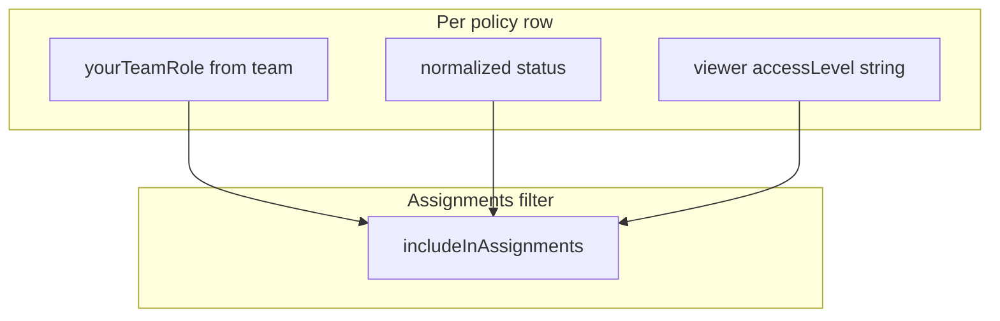
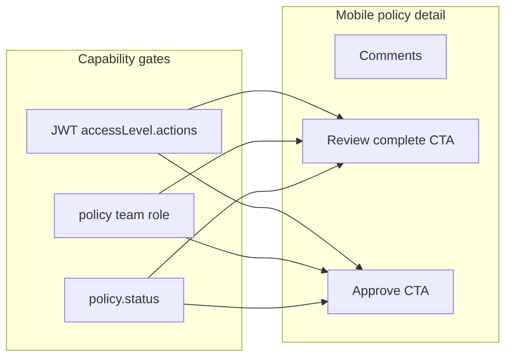

# PRD review: roles, Review/Approve, and mobile gaps

## Source: production audit (drives mobile next steps)

Canonical write-up: **[docs/audits/policy-team-assignments-backend-audit.md](docs/audits/policy-team-assignments-backend-audit.md)**.

**Mobile must assume:** `GET /policies/get-policies-for-quick-actions` returns **every** policy where the user is in `policy.team`, **all statuses** — filtering is **client-side** until a backend assignment endpoint exists (audit §1, §8.1).

**Role on policy:** Derived from `**policy.team[]`** member’s `**accessLevel.name`** after populate (`[deriveViewerTeamRole](manageaze-mobile-app/src/features/policies/policy-cache.ts)`); match strings to backend `**ACCESS_LEVELS`** names (`Creator`, `Reviewer`, `Approver`, `Super User`). **Gap:** audit §5 — if `Team.creator` and `policy.team` drift, Creator+Draft rows can be wrong; escalate to Saad V. if observed.

**Library “Needs attention”:** Built from `**GET /policies`** merge in `[syncPolicyLibrary](manageaze-mobile-app/src/features/policies/policy-cache.ts)`. **Risk:** audit §3.1 — backend `getUserPolicies` filter bug may return **overbroad** rows for non–super users until fixed; mobile filter still applies Saad rules to **display**, but payload may be wrong — prefer backend fix in parallel.

**Out of scope for mobile-only:** Prototype types are not production truth (audit §6).

## What the PRD actually says

Source: [ManagEaze — Development Handover PRD b04f9ba12550820c8f608109e7f40c31.md](ManagEaze%20%E2%80%94%20Development%20Handover%20PRD%20b04f9ba12550820c8f608109e7f40c31.md) (Milestone 1).

- **Not “different screens per role” as separate products** — one mobile app with **different included capabilities**:
  - **Viewer**: read-only **approved** policy library.
  - **Reviewer**: in-progress policies, **comments**, **flag concerns** (PRD wording).
  - **Approver**: pending policies, **comments** (creation stays web-only).
- **Auth / permissions**: Gate features using `**user.accessLevel.actions`** (and related access level data from login/JWT), **not** `user.role` alone (same doc, “Access Level Model”).
- **Prototype reference** for how web thinks about workflow: `WorkflowSidebar.tsx`, `ApprovalConditions.tsx` (policy path in prototype), per PRD table — mobile is expected to **align behavior** with production + prototype, not invent a new IA.

So your intuition (“not Super User–only”) is right for **who can do what**, but the PRD does **not** require distinct tab stacks or route trees per global role. It requires **conditional actions** where policy + team membership + status match.

## Where Review / Approval live today (backend)

In [app-backend-manageaze/routes/policies.js](app-backend-manageaze/routes/policies.js):

| Method  | Path                                  | Who (high level)                                                                                                                                                                                                                    |
| ------- | ------------------------------------- | ----------------------------------------------------------------------------------------------------------------------------------------------------------------------------------------------------------------------------------- |
| `PATCH` | `/policies/policy-reviewed/:policyId` | `policyReviewed` — controller checks **Reviewer** + on **policy team** + status **IN REVIEW** + no unresolved comments ([controllers/policies.js](app-backend-manageaze/controllers/policies.js)). Route only uses `validateToken`. |
| `PATCH` | `/policies/approve/:id`               | `approvePolicy` — `**validateAction(POLICY_APPROVAL_CAPABILITIES)`** (Approver-level capability) plus controller checks approver on team + status ([controllers/policies.js](app-backend-manageaze/controllers/policies.js)).       |

Other workflow endpoints exist (`submit-for-review`, `move-to-draft`, `back-for-rework`, etc.) — mostly **creator / web** territory for Milestone 1.

Global capability matrix: [app-backend-manageaze/utils/access-level-actions.js](app-backend-manageaze/utils/access-level-actions.js) (`Reviewer` / `Approver` / `Creator` / `Super User`).

**Per-policy** context (what you see on a row) is already partly modeled for mobile via team role strings (e.g. `yourTeamRole`) from quick-actions / library normalization — that is the **policy-specific** leg of “role-wise,” not the global `accessLevel.name` alone.

## Where the mobile app is today

Under [manageaze-mobile-app/](manageaze-mobile-app/):

- **Policy Library**, **Assignments**, **Policy detail**, **Comments** — aligned with browsing + collaboration.
- **No** wired UI calling `PATCH .../policy-reviewed/:policyId` or `PATCH .../approve/:id` (grep shows no `policyReviewed` / approve usage in the RN tree).
- **Super User** is not a separate mobile “mode”; they see the same shell. Super User on **web** has broader actions (creator/workflow); mobile Milestone 1 explicitly **excludes** policy creation and much admin work.

So the confusion is expected: **PRD promises reviewer/approver actions**; **mobile UI has not yet exposed those server actions** beyond comments.

## Assignments and Library — role + status filtration (Reviewer / Approver / Creator)

### Product decision — Saad Hasnain (authoritative)

**My Assignments** must only list policies that are **assigned to the user** and **in that role’s stage** — not every team policy in every status.

- **Reviewer:** show only when **team role is Reviewer** and **stage is In review** (ignore Draft and other stages for that reviewer hat).
- **Creator:** show only when **team role is Creator** and **stage is Draft**.
- **Approver:** show only when **team role is Approver** and **stage is Pending approval** (maps to backend `SUBMITTED`; not Draft, not In review).

**One person, multiple roles on the same policy:** Per audit + product: **one hat per person per policy** in normal data. Implement **single** `(yourTeamRole, status)` check per row; no OR across roles unless bad data forces a fallback (fix upstream).

**“Super User can see more” — what that meant:** That was **not** a decision from Saad. It was an **open question** we left in the plan: *Should someone with Super User access see a **longer** assignments list (e.g. every non‑approved policy they’re on), or the **same strict** rules as Reviewer/Creator/Approver (only the row that matches their **current** step)?* Until Saad answers, default is to treat Super User like everyone else **per policy team membership**: use their **user record’s role on that policy** (`accessLevel.name` on the populated `policy.team` member) and the **same stage filter** (Reviewer → In review, etc.). If they need a **company-wide oversight** list, that may be a **different** screen or web-only — not assumed for My Assignments.

**Schema reference (backend):** [Policy.team](app-backend-manageaze/models/policy.js) is a **flat array of user refs** (what quick-actions queries). [Team](app-backend-manageaze/models/team.js) is a **separate** document per policy with `creator` / `reviewers` / `approvers`. Mobile today infers `yourTeamRole` from the **populated user** in `policy.team`; aligning with Saad may require also resolving against the **Team** document when the product source of truth is creator vs reviewer lists (confirm with Saad V. / web parity).

### Current gap (why Reviewers see Draft)

- [app-backend-manageaze/controllers/policies.js](app-backend-manageaze/controllers/policies.js) `**getPoliciesForQuickActions`** returns every policy where `**team` includes the user** — **no status filter** (Draft, IN REVIEW, SUBMITTED, etc.).
- Mobile [policy-cache.ts](manageaze-mobile-app/src/features/policies/policy-cache.ts) maps every quick-action row with `normalizePolicySummary(policy, true, viewerId)` — assignments always get `isActionRequired: true` regardless of workflow step.
- **Per-policy role** comes from `**yourTeamRole`** (`deriveViewerTeamRole` reads populated `team[].accessLevel.name`). **Global** role comes from [StoredUser.accessLevel](manageaze-mobile-app/src/services/storage/auth-storage.ts) string — use **per-policy `yourTeamRole` first** for queue rules; fall back to global when team is not populated (treat as risk / refetch).

Backend statuses ([constants.js](app-backend-manageaze/utils/constants.js)): `DRAFT`, `IN REVIEW`, `SUBMITTED`, `APPROVED`. Mobile [normalizeStatus](manageaze-mobile-app/src/features/policies/policy-cache.ts) maps to `**Draft`**, `**In review`**, `**Pending approval**`, `**Approved**`.

### Target rules (aligned with Saad H. + backend actions)

| Per-policy team role (`yourTeamRole`) | Include in **My Assignments** / **Needs attention** when status is…                                                                      |
| ------------------------------------- | ---------------------------------------------------------------------------------------------------------------------------------------- |
| **Reviewer**                          | **In review** only                                                                                                                       |
| **Creator**                           | **Draft** only                                                                                                                           |
| **Approver**                          | **Pending approval** only (`SUBMITTED` in API)                                                                                           |
| **Super User** (on team)              | **Same role + stage rules** as everyone else (Saad H., 2026) — not a broader “all non-approved” list on mobile. |

**Note:** Mobile derives **one** `yourTeamRole` per policy from the matching `policy.team` member. Overlap creator+reviewer **should not** happen by design (web validation); not OR logic unless data is dirty.

Apply the **same filter** to **Policy Library → Needs attention**. **Approved library** unchanged.

**Mobile implementation (audit §8.3):**

1. Add `**includePolicyInAssignmentQueue(policySummary)`** (or pass raw API record + viewer id) in `[policy-cache.ts](manageaze-mobile-app/src/features/policies/policy-cache.ts)` or adjacent `policy-queue.ts` — compare `**yourTeamRole`** to `**status`** using normalized labels: Reviewer→In review, Creator→Draft, Approver→Pending approval, Super User→same strict pairing until PM overrides.
2. `**syncAssignments`:** after `normalizePolicySummary`, **filter** with the helper before `writeCache`.
3. `**getCachedAssignments`:** filter when re-reading cache (or invalidate old cache via key bump).
4. `**syncPolicyLibrary`:** for `**actionPolicies`** from `GET /policies`, **filter each row** with the same helper before merge into “needs attention” side; **approved** list unchanged.
5. **Bump cache keys** — e.g. `assignments.v4`, `library.v4` in `[keys` object](manageaze-mobile-app/src/features/policies/policy-cache.ts).
6. `**isActionRequired`:** set **true** only when the row **passes** the queue filter (not “always true” for assignments).
7. **Optional UI:** `[assignments.tsx](manageaze-mobile-app/app/(tabs)`/assignments.tsx) / `[policies.tsx](manageaze-mobile-app/app/(tabs)`/policies.tsx) may apply the same helper defensively if reading stale cache.

**Backend (separate work, audit §8.1–8.2):** Narrow quick-actions or add `GET /user/assignments`; fix `getUserPolicies` / `isUserInTeam` misuse — **not required** to ship mobile filter but improves data quality.

## Recommended product interpretation (resolve “different role-wise screens”)

Two valid UX patterns; both satisfy the PRD if gates are correct:

1. **Single policy detail route, role-aware footer / sheet** (matches “prototype parity, minimal routes”): On [manageaze-mobile-app/app/policy/[id].tsx](manageaze-mobile-app/app/policy/[id].tsx), show **Mark reviewed** (or equivalent) only when user is reviewer-on-team + policy in review + comments resolved per server rules; show **Approve** (or multi-step confirm) only when user is approver + correct status. Same screen, different CTAs.
2. **Optional sub-routes** (e.g. `/policy/[id]/workflow`) — only if you want heavier workflow UI; PRD does not require this for M1.

For **“screens per policy”** (not per global role): use **Assignments** vs **Library** plus **detail CTAs** driven by `(accessLevel.actions, yourTeamRole, policy.status)` — that matches both PRD and backend.

## Policy list cards — remove purple “accent stripe” (UI iteration)

**Current behavior:** [manageaze-mobile-app/src/components/policy/PolicyListCard.tsx](manageaze-mobile-app/src/components/policy/PolicyListCard.tsx) applies `cardAccent` when `accent === "primary"`: a **4px left border** in `colors.primary` (purple). [manageaze-mobile-app/app/(tabs)/policies.tsx](manageaze-mobile-app/app/(tabs)/policies.tsx) passes `accent="primary"` for **Needs attention** rows; [manageaze-mobile-app/app/(tabs)/assignments.tsx](manageaze-mobile-app/app/(tabs)/assignments.tsx) uses it for every assignment card. That double-emphasis (stripe + status chip) reads as generic “AI card” chrome.

**Direction:** Drop the left stripe entirely for a cleaner, more product-native list.

**Preferred hierarchy (pick one primary signal, avoid decoration stacking):**

1. **Status chip only** — The colored pill already encodes workflow; keep white cards with consistent border/shadow. Section headers (“Needs attention”, “My Assignments”) already communicate queue context, so cards do not need a second queue marker.
2. **Optional affordance** — If you want “tappable list row” clarity without color bars: a **small chevron** (`chevron-forward`) on the trailing edge (muted), or slightly stronger **pressed state** on `Pressable`. Avoid duplicating status in both stripe and chip.
3. **Optional subtle emphasis for “action required”** — If you still need differentiation inside a mixed list: **1px ring** or **very light tinted card background** (e.g. 2–3% primary tint on the whole card) instead of a vertical bar — must stay subtle and pass contrast for text.

**Implementation note (when executing):** Remove `accent` prop or keep it as no-op; delete `cardAccent` / `cardNeutral` split and fix `paddingLeft` asymmetry. Update both tab screens to stop passing `accent="primary"` (or remove prop usages).

## Anti-slop UI — Stitch, 21st.dev, and design skills

Deliberate **visual refinement pass** (after or in parallel with functional work):

1. **Stitch (MCP)** — Pull reference screens from the ManagEaze Stitch project (Polished / Refined library + detail). Use for **hierarchy, spacing, and card chrome** — translate to RN, do not screenshot-copy blindly.
2. **21st.dev** — Optional: explore **list row / card** variants and micro-interaction ideas compatible with [design tokens](manageaze-mobile-app/src/design/tokens.ts); port chosen patterns manually into components.
3. **Skills** — Checklist: `ui-ux-pro-max`, `frontend-design`, `taste-design`, `ckm-ui-styling`; for touch/a11y density cross-check `web-design-guidelines` concepts adapted to RN (hit area, contrast).

Record prompts and decisions in **docs** (e.g. [docs/stitch/](docs/stitch/) or mobile README) so the pass is repeatable.

## Product answers — Saad Hasnain (WhatsApp / voice, 2026)

Resolves open questions from the group thread. **Authoritative for mobile implementation.**

### Policy Library vs My Assignments

| Surface | What shows | What does **not** show |
|---------|------------|-------------------------|
| **Policy Library** | Policies that have **completed approval** and are published for the **company to read** | In-review, draft, submitted / pending-approval workflow items |
| **My Assignments** (and mobile **Needs attention** when user is on team) | Only rows where **your role on that policy** matches **that role’s stage** | Wrong stage for your hat (e.g. Reviewer must not see Draft) |

**Principle (Saad):** *“Role is role, stage is stage.”* Example: a reviewer may be **named** on a draft policy, but until status is **In review**, it does **not** belong in the reviewer’s assignment queue.

### Resolved Q&A (was “Questions we need answered”)

| # | Question | Answer (Saad) |
|---|----------|----------------|
| 1 | **Creators** — Draft in Assignments / Needs attention? | **Yes.** Creator on the policy + status **Draft** → show there. Same pattern as reviewer/approver. |
| 2 | **Super users** — see all non-approved on team? | **No.** Same **role + stage** rules; list stays short and clear. |
| 3 | **Web vs mobile** — match web quick actions exactly? | **N/A for parity on “create policy”.** Policy **creation** stays **web** (early product decision). Web quick actions include create-policy etc.; mobile does not ship that flow. Mobile assignments = **role + stage** filter on team policies, not a copy of the full web quick-action menu. |
| 4 | **“Flag concerns”** — comment vs separate flag? | **Unanswered** — Saad did not recognize “flag concerns” in the product. **Clarify** where that wording came from (PRD Milestone 1 reviewer bullet?) before building a separate flag action. **Default for M1:** comments only. |

### Ops / collaboration (not code)

- Prior handover doc includes **“AI in Mobile App”** + **notes from prototype implementation** (screenshots + copyable code in [`manageaze-prototype`](manageaze-prototype/)).
- **Claude subscription** for the team: process when Faisal is back (per Adeem).
- **Prod AI stack:** uncertain without Saad V. — ping **Saad Vakil** for policy-maker / RAG / `ask-ai` wiring before mobile AI ships.

---

## AI in Mobile App (separate track — after core lists/CTAs)

Documented in the prior handover deck (Milestone 1 — Part A). **Not in [`manageaze-mobile-app`](manageaze-mobile-app/) today.** Prototype is the **design + UX reference**; production paths differ.

### Requirements (from product deck)

1. **Policy & KB Q&A** — Natural-language questions; answers grounded in **company approved policies + knowledge base**; **citations** (policy title + section) for auditability.
2. **Conversational follow-ups** — Multi-turn sessions with context retained.
3. **Status / metadata questions** — e.g. pending renewal, who approves a named policy (may use **non-approved metadata** in prototype; mobile should align with what prod API exposes).
4. **Streaming responses** — Tokens render in real time (match prototype UX).
5. **Citations & deep links** — Each cited policy links into the **in-app policy reader** (Milestone 1 Part A).

### Prototype reference (copy / adapt — not deployed)

| Piece | Path |
|-------|------|
| Main UI | [`manageaze-prototype/src/pages/PolybotAIAgent.tsx`](manageaze-prototype/src/pages/PolybotAIAgent.tsx) — streaming via `streamAIText`, RAG (`getRAGContext`), company knowledge, draft-policy tool |
| Chat API (dev server) | [`manageaze-prototype/server.js`](manageaze-prototype/server.js) `POST /api/chat` — `streamText`, tools |
| AI elements | [`manageaze-prototype/src/components/ai-elements/`](manageaze-prototype/src/components/ai-elements/) |
| Hooks / transport | [`manageaze-prototype/src/ai/hooks/use-chat.ts`](manageaze-prototype/src/ai/hooks/use-chat.ts), [`custom-chat-transport.ts`](manageaze-prototype/src/ai/custom-chat-transport.ts) |

Use **live prototype screenshots** for layout; port interaction patterns to RN manually.

### Production stack (web — confirm with Saad V.)

| Piece | Path | Notes |
|-------|------|--------|
| Ask AI (non-streaming) | [`app-frontend-manageaze/src/pages/api/policies/ask-ai.js`](app-frontend-manageaze/src/pages/api/policies/ask-ai.js) | Company policies + `companyInfo`; returns `answer`, `sources`, `statusSummary` |
| Ask AI UI | [`app-frontend-manageaze/src/components/features/ask-ai/index.js`](app-frontend-manageaze/src/components/features/ask-ai/index.js) | Web dashboard |
| Streaming chat | [`app-frontend-manageaze/src/pages/api/policies/chat-stream.js`](app-frontend-manageaze/src/pages/api/policies/chat-stream.js) | Proxies policy-maker |
| RAG socket | [`app-backend-manageaze/namespaces/rag-chatbot.js`](app-backend-manageaze/namespaces/rag-chatbot.js) | Socket.IO namespace |
| Policy-maker service | External module (`NEXT_PUBLIC_AI_MODULE_BASE_URL`) — see [multi-repo plan](.cursor/plans/manageaze_multi-repo_governance_512af11b.plan.md) §1.5 | **Do not** call OpenAI from mobile with exposed keys |

**Mobile AI implementation rule:** All LLM calls through **authenticated backend** (Express and/or policy-maker), same JWT as policies; stream over HTTP/SSE or Socket per prod pattern.

### AI mobile — suggested phases (when prioritized)

1. **Spike with Saad V.** — Which endpoints mobile should call; whether citations use approved library only; KB scope.
2. **RN screen** — Chat UI (stream + markdown); session/history minimal for M1.
3. **Deep links** — Citation tap → [`app/policy/[id].tsx`](manageaze-mobile-app/app/policy/[id].tsx).
4. **Security** — No `NEXT_PUBLIC_OPENAI_*` on device; rate limits server-side.

---

## Implementation plan (when you exit plan mode)

1. **Spec matrix** — One-pager from audit §3–4 + Saad table: role label ↔ status ↔ PATCH endpoint; document `SUBMITTED` ↔ Pending approval.
2. `**includePolicyInAssignmentQueue` + cache bump** — As in “Mobile implementation” above; unit-test matrix cases with mock `PolicySummary`.
3. **API client** — `patchPolicyReviewed`, `patchApprovePolicy` ([routes](app-backend-manageaze/routes/policies.js)).
4. **Policy detail** — CTAs gated by same role+status rules + server constraints; invalidate assignments + library cache on success.
5. **Viewer / role hardening** — Hide CTAs when row would not pass queue filter; approved library unchanged.
6. **List card polish** — Remove purple stripe; optional chevron.
7. **Design pass** — Stitch + 21st + skills; document prompts.
8. **QA** — Checklist audit §7; verify **GET /policies** overbreadth if backend not fixed yet.
9. **Backend PR (optional)** — Track audit §3.1 + §2.4 fixes separately (plan todo `backend-audit-followup`).
10. **AI mobile (later)** — After steps 1–8; todo `ai-mobile-scope`.

## Remaining follow-up (product / backend)

- **Flag concerns** — Ask Saad H. what “flag concerns” refers to; until then, **comments only** for reviewer collaboration.
- **Canonical assignments API** — Still `get-policies-for-quick-actions` + client filter unless backend adds filtered endpoint (audit §8.1).
- **Team vs `policy.team`** — Saad confirmed role+stage logic; if Creator+Draft rows are wrong in data, escalate to Saad V. (Team document vs flat `policy.team` + `accessLevel.name`).
- **AI prod wiring** — Saad V.: policy-maker repo, which mobile endpoints, KB/RAG availability on mobile.

